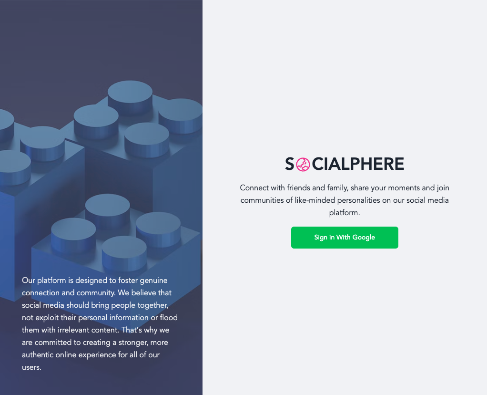
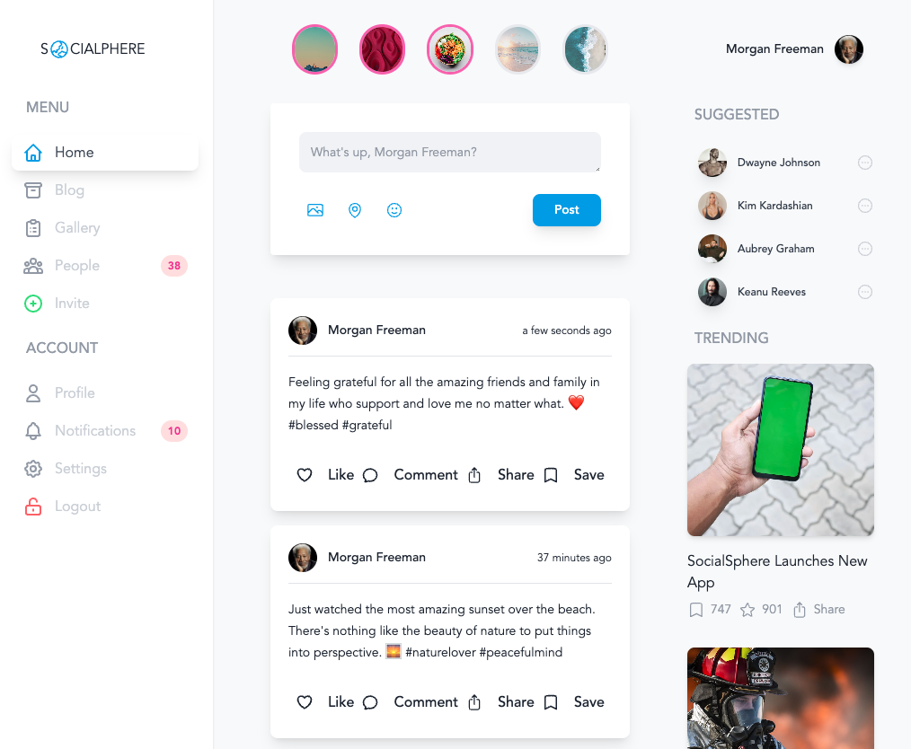
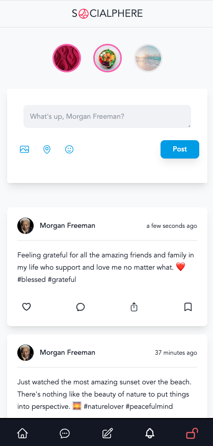

# SocialSphere 🌏 - Social Media App



## Overview

SocialSphere is a platform designed to foster genuine connection and community. We believe that social media should bring people together, not exploit their personal information or flood them with irrelevant content. That's why we are committed to creating a stronger, more authentic online experience for all of our users.

### <a href="https://socialsphere.vercel.app/">Demo</a>





## Features & Technology

- [Next.js](https://nextjs.org/)
- [PostgreSQL](https://www.postgresql.org/)
- [TailwindCSS](https://tailwindcss.com/)
- [Supabase](https://supabase.com/)
- [Moment](https://momentjs.com/)
- [Google OAuth](https://developers.google.com/identity/protocols/oauth2)
- [React Context](https://reactjs.org/docs/context.html)

## Installation

To clone and run this application, you'll need [Git](https://git-scm.com) and [Node.js](https://nodejs.org/en/download/) (which comes with [npm](http://npmjs.com)) installed on your computer.

From your command line:

```bash
# Clone this repository
$ git clone https://github.com/trdotpy/socialsphere

# Go into the repository
$ cd socialsphere

# Install dependencies
$ npm install

# Create .env file in root directory
$ touch .env

# Set environment variables
GOOGLE_ID = 'Enter Google Client ID'
GOOGLE_SECRET = 'Enter Google Secret'
NEXTAUTH_SECRET = 'Enter Next-Auth Secret'

# Run the app
$ npm run dev
```

## Contact

[](https://github.com/trdotpy/)
[](mailto:tanvi.rahman@outlook.com)
