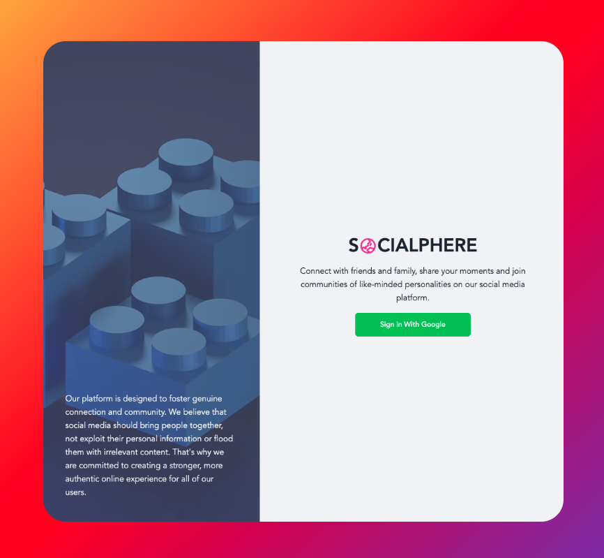
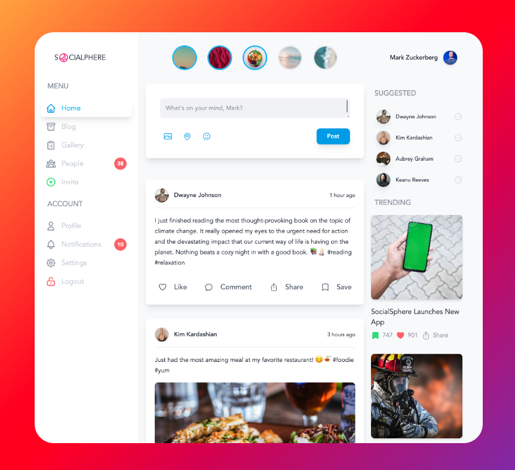

<div align='center'>

# SocialSphere - Social Media App

<!-- Hero -->

<a href="https://socialsphere.vercel.app/">
	<div align='center'>
  	
  </div>
</a>

</div>

<!-- Hero End -->

<br>

<!-- Tech -->
<div align='center'>


</div>

<br>

<!-- Tech End -->

<!-- Screenshots -->

<div align='center'>






</div>

<br>

<!-- Screenshots End -->

<!-- Overview -->

<div align='center'>

## Overview

SocialSphere is a platform designed to foster genuine connection and community. We believe that social media should bring people together, not exploit their personal information or flood them with irrelevant content. That's why we are committed to creating a stronger, more authentic online experience for all of our users.

</div>

<!-- Overview End -->

<br>

<!-- Run -->
<div align='center'>

## How to Run Locally

To clone and run this application, you'll need [Git](https://git-scm.com) and [Node.js](https://nodejs.org/en/download/) (which comes with [npm](http://npmjs.com)) installed on your computer.

</div>

From your command line:

```bash
# Clone this repository
$ git clone https://github.com/trdotpy/socialsphere

# Go into the repository
$ cd socialsphere

# Install dependencies
$ npm install

# Create .env file in root directory
$ touch .env

# Set environment variables
NEXT_PUBLIC_SUPABASE_URL=
NEXT_PUBLIC_SUPABASE_ANON_KEY=

# Run the app
$ npm run dev
```

<!-- Run End -->

<br>

<!-- Contact -->
<div align='center'>

## Contact

<a href="https://trdotpy.dev/">
  
</a>
<a href="https://www.linkedin.com/in/trdotpy/">
  
</a>
<a href="mailto:tanvi.rahman@outlook.com">
  
</a>
</div>

<!-- Contact End -->

<!-- License -->

<div align='center'>

## License

[MIT](https://choosealicense.com/licenses/mit/)

</div>

<!-- License End -->
